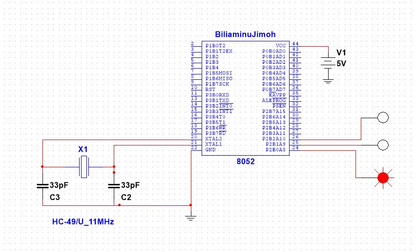

# trafficLightcode
This is a simple embedded operating system code written in C for a traffic using interrupt service routine
AT89C52 is used as target device to simulate this code in Keil microvision. Interrupt service routine was used to create a basic operating system for a traffic light system. Header files and c source codes were use to make the codes readable.
Here is the image showing simulation in multism

